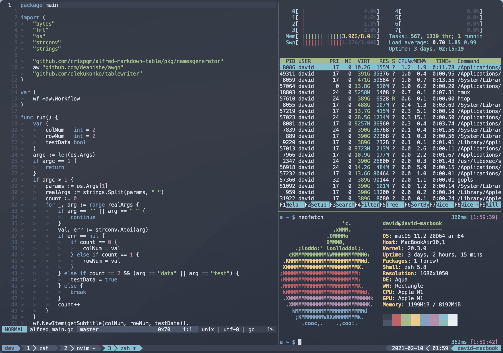

# dotfiles

<p align="center">
  
</p>

<p align="center">
  
  
</p>

## Introduction

This is a dotfiles project which may be used to provision a new macOS with cosy dev setups.
And it is tested with GitHub Actions CI. The checkbox denotes whether it is done by `bootstrap`.
More screenshots [here](screenshots).

Inspired by [KrauseFx/new-mac](https://github.com/KrauseFx/new-mac).

For Arch Linux, please refer to [crispgm/arch-linux-dotfiles](https://github.com/crispgm/arch-linux-dotfiles).

## Bootstrap

```shell
$ xcode-select --install # or download here <https://developer.apple.com/download/more/>
$ git clone --recursive https://github.com/crispgm/dotfiles.git
# Login to AppStore with Apple ID, since there are MAS apps in Brewfile
$ cd dotfiles
$ ./bootstrap
```

## Project Layout

- `bootstrap`: entry point of dotfiles bootstrapping.
- `Brewfile`: all Homebrew formulae and casks managed by Homebrew Bundle.
- `rc`: dotfiles managed by [rcm](https://github.com/thoughtbot/rcm).
- `app`: customized boostrapping scripts for applications.

## Dev Setups

### Terminal & Shell

- [x] Install [Homebrew](https://brew.sh)
- [x] Setup Hostname `sudo scutil --set HostName david-macbook`
- [x] Install softwares and fonts from [Brewfile](https://github.com/crispgm/dotfiles/blob/master/Brewfile) with `brew bundle`. HINT: Login to AppStore at first. Some of the applications from Mac App Store may need purchase.
- [x] Install `zsh`, `oh-my-zsh` and setup `.zshrc`
- [x] Setup Alacritty
- [x] Setup tmux
- [x] Setup Neovim

### Git

- [x] Git global config
- [x] Git work config

### Ruby

- [x] Setup `.gemrc`
- [x] Setup bundler's mirror: `bundle config mirror.https://rubygems.org https://gems.ruby-china.com` if you locate in China mainland

### VSCode

- [x] Create `code` SymLink: `sudo ln -s /Applications/Visual\ Studio\ Code.app/Contents/Resources/app/bin/code ~/Applications/code`
- [x] Install `Setting Sync` extensions and then sync settings

### File Sync

- [x] Install your favorite file sync service (e.g. Dropbox, Google Drive, One Drive ... I prefer Dropbox because it works with Alfred)
- [ ] Setup syncing folder for apps (e.g. Alfred, Dash ...)

### Karabiner

- [x] Setup `karabiner.json`

## macOS Setups

### Trackpad

- [ ] Tap to click
- [ ] Seconary click: Click in bottom right corner

### Control Center

#### Battery

- [ ] Show Battery in Control Center
- [ ] Show percentage

#### Time

- [ ] Set time zone automatically using current location
- [ ] Use a 24-hour clock and show date

#### Siri

- [ ] Disable Siri system wide and remove Siri button from Touch Bar

### Finder

- [ ] New Finder show Desktop
- [ ] Remove labels and clean up Sidebar

### Dock

- [ ] Change to the size you like
- [ ] Cancel: Show recent application in Dock
- [ ] Downloads: View content as Grid
- [ ] Add blank seperator: `defaults write com.apple.dock persistent-apps -array-add '{tile-type="spacer-tile";}'`

### Mission Control

- [ ] Disable automatically rearrange Spaces based on most recent use

### Keyboard

- [ ] Input Sources -> Automatically switch to a document's input source
- [ ] Add more input sources that you like

#### Keyboard Shortcuts

- [ ] Show Launchpad: `F4`
- [ ] Select the previous input source: `Option + Space`
- [ ] Copy picture of selected area to clipboard: `Command + Shift + a`

## Optional Setups

### bash

- [x] Setup shell login promtp with `motd`: ASCII art is generated with <http://patorjk.com/software/taag/>
- [x] Setup `.bash_profile` `.bashrc`
